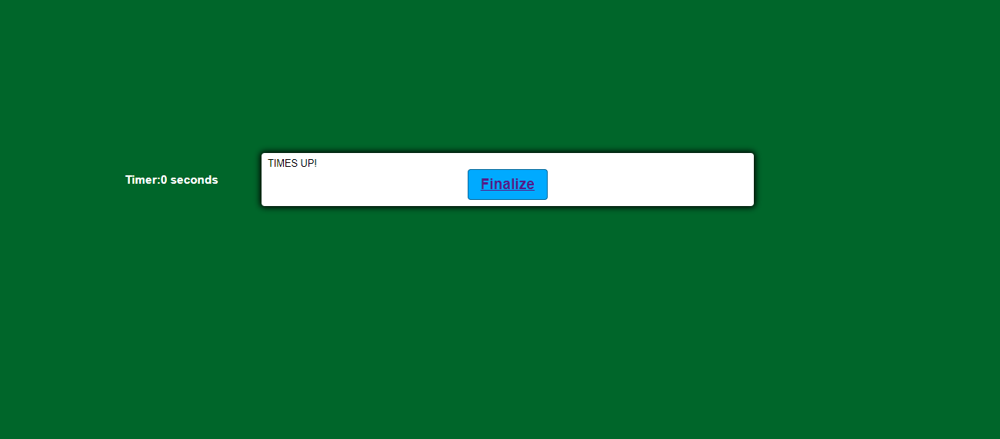

# Coding-Quiz

## The Project

For this project I've created an interactive quiz where questionairre is focused on javascript fundamentals. The project contains very simple HTML and CSS portions as the backbone of this project is the javascript contained within. As always, the code lends itself to repurposing/refactoring to suit multiple needs and has built-in parameters to increase fun-factor for education or even a trivia night with friends.

I originally started with each question being an individual function that simply called the next, but as you'd expect I ended up pushing more bugs into production with each additional feature slapped on. After 8+ hours of trying to debug, implement new feature, debug again, I decided the best possible option was simply to create an object and have the quiz shuffle through a series of questions and answers attached to those questions.

Needless to say, mdn and w3schools along with immense tutorials on arguments and methods via youtube were major lifesavers in this project.

## Usage

Simply click the start button and have a laugh or two. But not too many! With only thirty seconds on the clock and ten gruelling questions with four answers each, you'll be pressed for time even if the questions aren't terribly challenging. Each incorrect answer will knock a precious second off the clock, so be precise!

## Credits

Countless hours spent on mdn and w3 schools to get the functions working.

## Features

**A question/answer randomizer that keeps all answers paired with a question.**
**The ability to have multiple CORRECT answers, not just INCORRECT answers.**
**A score screen that keeps a user's score in local storage.**
